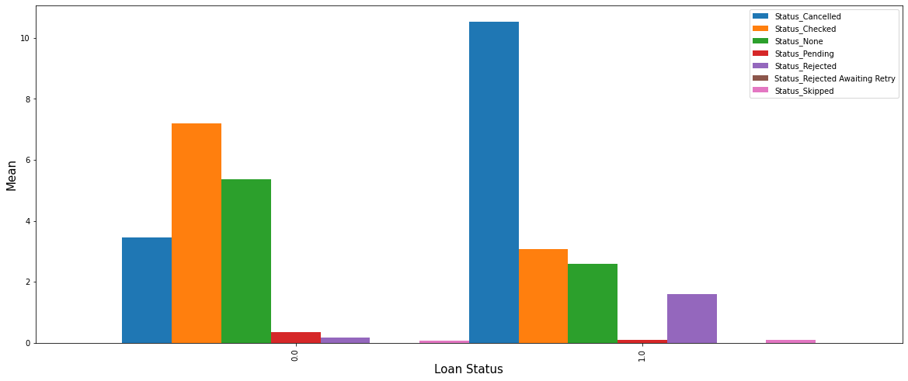
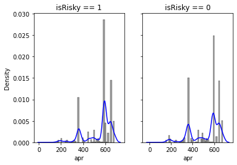
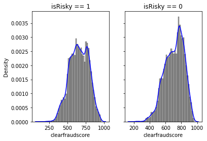
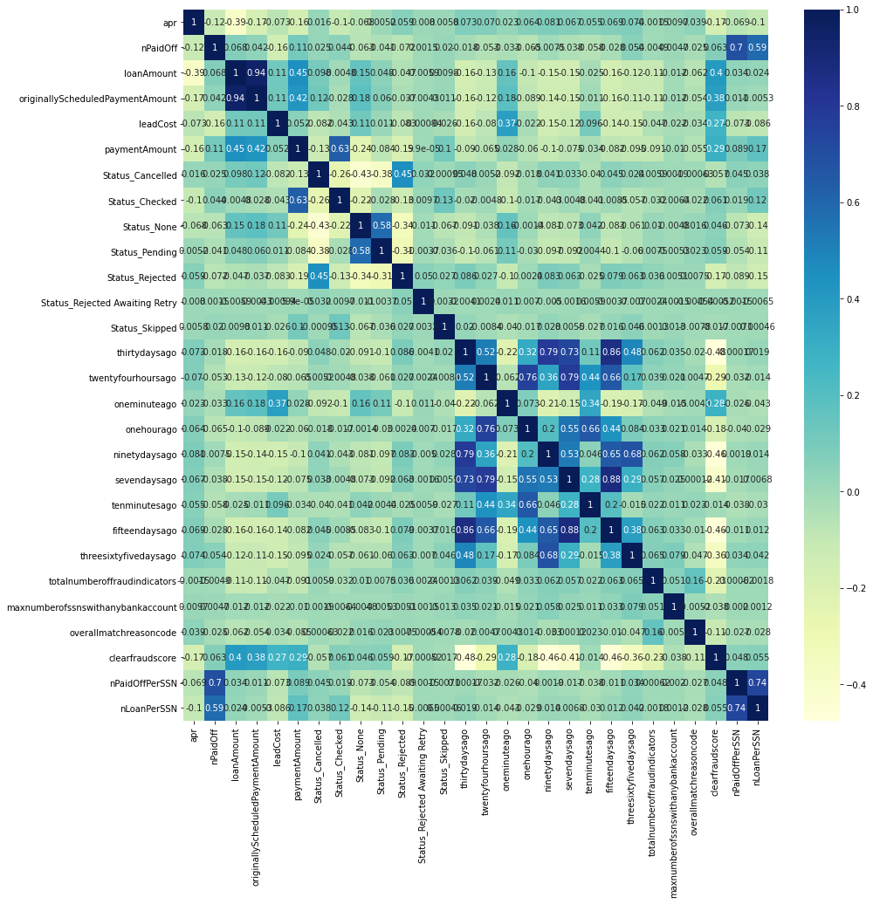
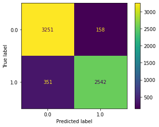

# Loan Repayment Challenge (Risky Loan Classifier): Project Overview
* Created a tool that predict risky loan ($F_{1} score: 0.909$) to help the financial company decide whether to approve the loan.
* Feature engineering on total payment status and summing-up total effective payment amount for each loan id.
* Feature creation on total loan and total paid off per client.
* Model building on Logistic Regression, Decision Tree, Random Forests, Voting Classifier and XGB Classifier.
* Optimized XGB Classifier by feature selection & fine-tuning hyperparameters to reach the best model.

## Resources Used
**Python Version:** 3.9.6    
**Packages:** numpy, pandas, matplotlib, seaborn, sklearn, joblib, xgboost

## Data Exploration
Below are some highlights during data exploration.
* Payment status

* Annual payment rate

* Clear fraud score

* Correlation

## Feature Engineering
* Use loan status to define risky or non-risky (quality) loan.
* Remove data that didn't have loan id on payment dataset and underwriting id on underwriting dataset.
* Remove features that consists of  $>30\%$ missing values.
* Impute missing values mostly with mode.
* Feature selection by dropping highly correlated columns.
* Feature engineering on total payment status and summing-up total effective payment amount for each loan id.
* Feature creation on total loan and total paid off per client.

## Data Preprocessing
* Split the data into 3 sets ($60\%$ training data, $20\%$ validation data and $20\%$ testing data)
* Use **`One Hot Encoder`** and **`Ordinal Encoder`** to encode into categorical data
* Use **`Standard Scaler`** to normalize numeric data
* Use **`Column Transformer`** to transform data

## Model Building
* Tried five different models and evaluated them using $F_{1} score$. 
* Choose $F_{1} score$ because it is the combination of precision and recall and only produces high score if both of them are high.
* Use **`Pipeline`** to combine preprocessor and model.

Five different models I tried:
* **Logistic Regression** - Baseline for the model
* **Decision Tree** - Inexpensive and fast algorithm
* **Random Forest** - Powerful and robust to outliers & skewness
* **Voting Classifier** - Reduce bias and increase generalization
* **XGB Classifier** - optimized Gradient Boosting with high flexibility

## Model Performance
The **XGB Classifier** model is the best compared to the others on validation set by considering overfitting issue.

* **Logistic Regression** - 0.872329
* **Decision Tree** - 0.859257 (100% training accuracy)
* **Random Forest** - 0.896700 (100% training accuracy)
* **Voting Classifier** - 0.894953 (100% training accuracy)
* **XGB Classifier** - 0.894953

## Model Tuning
* Tune using feature selection and hyperparameters tuning on **XGB Classifier**
* Use threshold **0.001** to drop columns where its feature importance is less than threshold
* Optimized hyperparameters:

|Hyperparameter|Value|
|:-|:-|
|`eta`|`0.1`|
|`gamma`|`1`|
|`max_depth`|`7`|
|`min_child_weight`|`3`|
|`subsample`|`1`|

## Final Model Performance
* Performance evaluation based on testing set

|$F_{1}$ Score|Precision|Recall|Accuracy|
|:-|:-|:-|:-|
|0.908993|0.941481|0.878673|0.919232|

* Confusion Matrix

